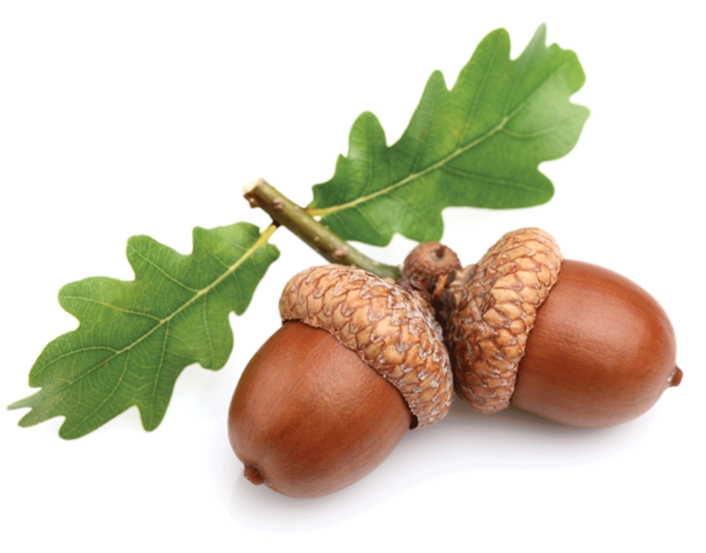

# Early Math

## Counting American Coins

## Counting Dollars

- *oma* (plural omas) (among people of German ancestry) grandmother, grandma.
- *purse*: a small bag used especially by a woman to carry everyday personal items.
- *snow cone*: granular ice molded into a ball and flavored with a syrup.
- acorns: 